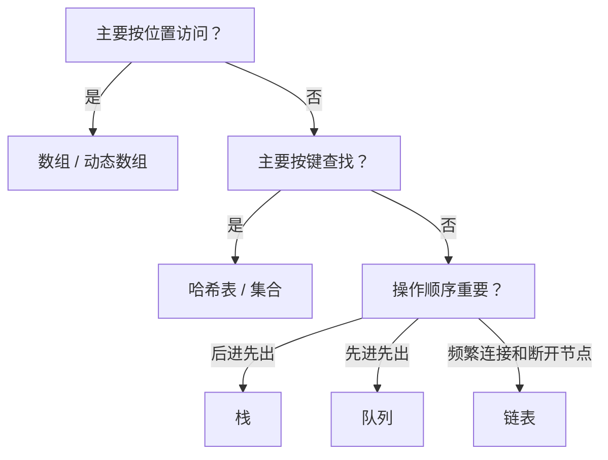

# 线性数据结构

线性结构中的元素可以理解成排成一列，但“排成一列”的实现方式不同，会导致不同操作的成本。

## 完整目录

| 家族 | 主题 | 核心问题 |
| --- | --- | --- |
| 数组 | 固定数组、动态数组、矩阵、稀疏数组 | 按位置快速访问 |
| 字符串 | 不可变字符串、字符数组、编码 | 文本如何存储和处理 |
| 链表 | 单链、双链、循环链、跳表 | 节点如何连接 |
| 栈 | 数组栈、链式栈、最小栈 | 后进先出 |
| 队列 | 普通队列、循环队列、双端队列 | 先进先出 |
| 哈希 | 哈希表、集合、开放寻址、链地址 | 根据键快速定位 |
| 概率结构 | Bloom Filter、Cuckoo Filter | 用少量空间近似判断存在 |
| 位存储 | Bitmap、Bitset | 用二进制位压缩状态 |

## 选择结构的思考顺序

[学习数组 →](./arrays) · [学习链表、栈与队列 →](./linked-stack-queue)
